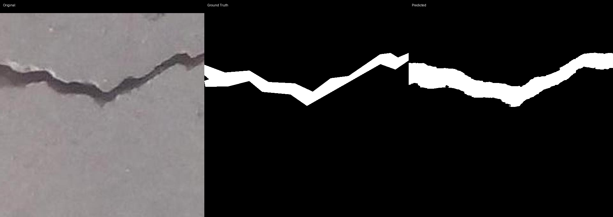
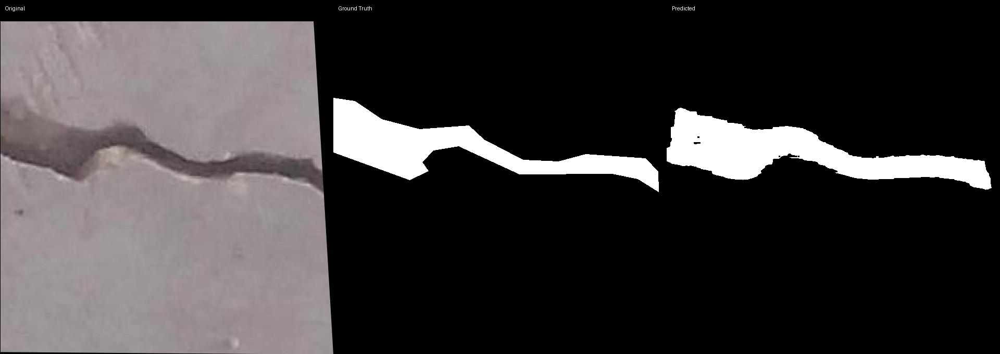
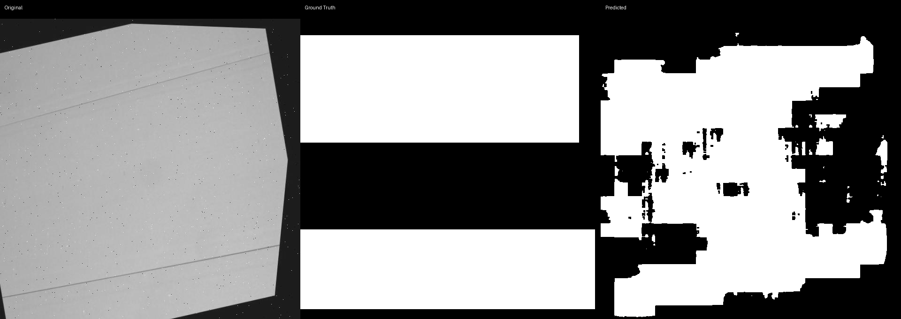
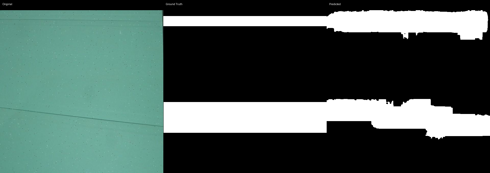

# Prompted Segmentation for Drywall QA

## 1. Goal

The idea here is simple: given a drywall image and a short text prompt like "segment crack" or "segment taping area", the model should output a binary mask highlighting where the defect is. This covers two defect types — wall cracks and drywall joint taping — so the system could eventually plug into an automated inspection pipeline on a construction site.

## 2. Methodology

### 2.1 Why CLIPSeg

I went with CLIPSeg (`CIDAS/clipseg-rd64-refined`). It's built on top of CLIP's ViT-B/16 backbone and adds a lightweight decoder that uses FiLM conditioning to go from text + image → mask. One forward pass, done.

I looked at a few other options before settling on this:

| Model | Text-Conditioned | Fine-tunable | Speed | Why Not |
|-------|-----------------|--------------|-------|---------|
| SAM + CLIP routing | Indirect | Two-stage hack | Moderate | No joint optimization — you'd be chaining two models and hoping the routing works |
| GroundingDINO + SAM | Yes | Limited | Slow | Way overkill for binary segmentation |
| LLaVA / BLIP-2 + decoder | Yes | No | Very slow | Needs way more GPU than what's available here |

CLIPSeg won because it does text-to-mask natively, I can fine-tune just the decoder without blowing up VRAM, and the whole thing is a single forward pass which makes evaluation straightforward.

### 2.2 Training Setup

I only fine-tuned the decoder — 1.1M params, which is 0.7% of the whole model. The CLIP backbone stayed frozen. No point messing with pretrained vision-language features when VRAM is tight.

| Component | Status | Params |
|-----------|--------|--------|
| CLIP backbone (vision + text) | Frozen | 149.6M |
| Decoder (FiLM, projection, transformer, conv) | Trainable | 1.1M |

**Prompt variants:** I sampled random prompt phrasings per batch during training. This forces the model to not overfit to one exact wording:
- Cracks: `"segment crack"`, `"segment wall crack"`
- Taping: `"segment taping area"`, `"segment joint/tape"`, `"segment drywall seam"`

**Loss:** BCE + Dice, equal weight. BCE gives stable pixel-level gradients; Dice directly optimizes overlap, which is what we're actually measuring at eval time.

**Optimizer:** AdamW, lr=5e-5, weight decay 1e-4. Cosine LR schedule with 100-step linear warmup.

**Augmentation (train only):** Kept it conservative. Thin cracks fall apart under aggressive augmentation — seen it happen before.
- HorizontalFlip (p=0.5)
- RandomBrightnessContrast (±0.2, p=0.5)
- GaussNoise (std 10–50, p=0.3)
- RandomScale (±20%, p=0.3)

**Inference:** CLIPSeg's raw logits aren't calibrated on construction imagery, so I swept thresholds [0.2–0.7] on the validation set per prompt and picked the one with best mIoU. Logits get upsampled from 352×352 to 640×640 before thresholding — doing it the other way around introduces aliasing. Tried morphological closing too (3×3 kernel); kept it since it marginally helped.

## 3. Data Preparation

### 3.1 The Datasets

Both from Roboflow Universe, both already at 640×640, both in COCO JSON format:

| Dataset | Images | Annotation Type | Source |
|---------|--------|----------------|--------|
| Cracks | 5,369 | Polygon segmentation | [Roboflow](https://universe.roboflow.com/fyp-ny1jt/cracks-3ii36) |
| Taping | 1,022 | Bounding box only | [Roboflow](https://universe.roboflow.com/objectdetect-pu6rn/drywall-join-detect) |

### 3.2 Splits

Roboflow exports already come pre-split (~70/15/15). I used them as-is — re-splitting would've been extra work for no real benefit.

| Split | Cracks | Taping | Total |
|-------|--------|--------|-------|
| Train | 3,758 | 715 | 4,473 |
| Valid | 805 | 153 | 958 |
| Test | 806 | 154 | 960 |
| **Total** | **5,369** | **1,022** | **6,391** |

### 3.3 Mask Generation

COCO JSON → binary PNG masks ({0, 255}, single-channel):
- **Cracks:** `cv2.fillPoly` on the polygon segmentation. Had to skip 16 annotations that had empty segmentation arrays (42 total across splits — not a big deal).
- **Taping:** This is the tricky one. Every single annotation is a bounding box — no polygons at all. So I rasterized them as filled rectangles with `cv2.rectangle`. It's not perfect (real tape edges aren't perfectly rectangular), but it's a reasonable geometric proxy and it's all we have.

Seed fixed to `42` everywhere — augmentation, prompt sampling, everything.

## 4. Results

### 4.1 Test Metrics

| Prompt | Threshold | Test mIoU | Test Dice |
|--------|-----------|-----------|-----------|
| segment crack | 0.4 | 0.4859 | 0.6338 |
| segment taping area | 0.4 | 0.5586 | 0.7063 |
| **Mean** | **0.4** | **0.5222** | **0.6700** |

### 4.2 Threshold Sweep (Validation Set)

| Threshold | Cracks mIoU | Cracks Dice | Taping mIoU | Taping Dice |
|-----------|-------------|-------------|-------------|-------------|
| 0.2 | 0.4937 | 0.6396 | 0.5605 | 0.7039 |
| 0.3 | 0.4975 | 0.6440 | 0.5701 | 0.7124 |
| **0.4** | **0.4979** | **0.6451** | **0.5711** | **0.7136** |
| 0.5 | 0.4962 | 0.6443 | 0.5685 | 0.7118 |
| 0.6 | 0.4922 | 0.6412 | 0.5629 | 0.7076 |
| 0.7 | 0.4851 | 0.6352 | 0.5518 | 0.6989 |

Both prompts peak at 0.4. The cracks curve is pretty flat (range 0.485–0.498), so threshold doesn't matter much there. Taping is more sensitive (0.552–0.571).

### 4.3 Consistency

Split each dataset into Low/Medium/High tertiles based on image brightness, edge density, and defect size. Here's how mIoU holds up:

**Cracks:**

| Stratum | Low | Medium | High | Stable? |
|---------|-----|--------|------|---------|
| Brightness | 0.4770 | 0.5018 | 0.4788 | Yes |
| Edge density | 0.4974 | 0.4888 | 0.4714 | Yes |
| Defect size | 0.3235 | 0.5429 | 0.5916 | **No** |

**Taping:**

| Stratum | Low | Medium | High | Stable? |
|---------|-----|--------|------|---------|
| Brightness | 0.5634 | 0.5857 | 0.5265 | Yes |
| Edge density | 0.5895 | 0.5121 | 0.5736 | Yes |
| Defect size | 0.4966 | 0.5736 | 0.6068 | Mostly |

The model handles lighting and scene complexity fine. The real problem is defect size — small cracks (0.32 mIoU) get crushed compared to large ones (0.59). More on this in the failure section.

### 4.4 Visual Examples

Original | Ground Truth | Predicted:

**Cracks:**

**Taping:**

### 4.5 Training Curve

20 epochs total, effective batch 4, cosine LR with 100-step warmup. Best checkpoint from epoch 17.

| Epoch | Train Loss | Val mIoU (Cracks) | Val mIoU (Taping) | Mean mIoU |
|-------|-----------|-------------------|-------------------|-----------|
| 1 | 0.3664 | 0.4455 | 0.3582 | 0.4018 |
| 5 | 0.2825 | 0.4782 | 0.5205 | 0.4994 |
| 10 | 0.2631 | 0.4884 | 0.5580 | 0.5232 |
| 15 | 0.2541 | 0.4966 | 0.5660 | 0.5313 |
| 17 | 0.2538 | 0.4961 | 0.5678 | **0.5319** |
| 20 | 0.2531 | 0.4954 | 0.5668 | 0.5311 |

Model was basically done learning by epoch 15. The last 5 epochs barely moved the needle (0.5313→0.5319). The decoder-only approach hit its ceiling.

## 5. Failure Cases and What Could Fix Them

### 5.1 Small Cracks Get Missed

This is the biggest issue. Small/thin cracks score 0.32 mIoU while large ones hit 0.59. These are sub-5px-wide cracks that essentially disappear at CLIPSeg's 352×352 internal resolution — by the time you upsample back to 640, the detail is gone.

**What might help:**
- Multi-scale inference — predict at 352 and 512, merge the outputs
- CRF post-processing to sharpen thin boundaries
- Bigger backbone (ViT-L), though that needs more VRAM

### 5.2 Taping GT Masks Are Just Rectangles

The taping dataset has zero polygon annotations. Every mask is a `cv2.rectangle` from the bounding box. Real tape seams aren't perfectly rectangular — they have angled or curved edges — so the GT itself is noisy. The model is being evaluated against an approximation, and there's a hard ceiling on how well it can do.

**What might help:**
- Run SAM with bbox prompts to generate pseudo-polygon masks, then retrain on those
- Manually fix a validation subset to measure how much the bbox proxy is hurting us

### 5.3 Model Capacity Runs Out

1.1M trainable params is not a lot. The model converged at epoch 15 and couldn't go further. The decoder architecture itself is the bottleneck — more training time won't help.

**What might help:**
- Unfreeze the last few CLIP vision encoder blocks (~10M more params). Current VRAM usage is only 0.74GB out of 15.6GB, so there's plenty of headroom.
- Knowledge distillation from a bigger model

## 6. Runtime and Footprint

| Metric | Value |
|--------|-------|
| Total training time | ~77 min (20 epochs on T4) |
| Avg inference time / image | ~37 ms |
| Model checkpoint size | 583.8 MB |
| Peak VRAM (training) | 0.74 GB |
| Peak VRAM (inference) | 0.74 GB |
| GPU | NVIDIA Tesla T4 (15.6 GB) |

## 7. Reproducibility

- Seed fixed to `42` everywhere (PyTorch, NumPy, CUDA)
- Python 3.11, PyTorch 2.x (CUDA 12.x), transformers 4.x, albumentations 2.x
- `pip install -r requirements.txt`
- Train: `python train.py --batch_size 2 --grad_accum 2 --epochs 20`
- Infer: `python infer.py --checkpoint outputs/checkpoints/best.pt`
- Evaluate: `python evaluate.py --checkpoint outputs/checkpoints/best.pt`

## 8. Key Engineering Decisions

| Decision | Choice | Why |
|----------|--------|-----|
| Data split | Roboflow as-is | Already pre-split ~70/15/15; re-splitting adds complexity for no gain |
| Taping GT | Bbox → rectangle | No polygons exist; rectangle is a decent proxy for linear seams |
| Backbone | Frozen | VRAM budget; pretrained features are good enough |
| Decoder | Fully unfrozen | FiLM layers are key for text-to-mask alignment |
| Threshold | Per-prompt, swept on val | CLIPSeg logits aren't calibrated on this domain |
| Loss | BCE + Dice | BCE for stability, Dice matches the eval metric |
| Upsample | Before thresholding | Thresholding after upsample causes aliasing |
